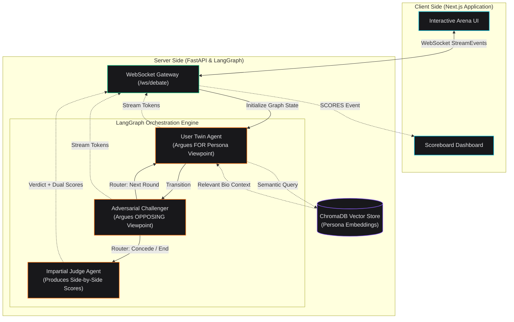

# GenAI Debate Twin — Multi-Agent Debate System

[](https://www.python.org/)
[](https://nextjs.org/)
[](https://fastapi.tiangolo.com/)
[](https://langchain-ai.github.io/langgraph/)
[](https://www.trychroma.com/)

A professional-grade, real-time multi-agent debate twin system. It allows you to ingest personal bio/persona documents, embed them locally into a vector database, and run automated debates on arbitrary topics between your **"AI Persona Twin"** (backed by RAG context) and an **AI Challenger** (representing the opposing stance).

---

## 🏛️ Architecture



The application leverages **LangGraph** to model the debate as a state machine:
1. **User Twin Node**: Retrieves relevant persona chunks from ChromaDB using the debate topic and the Challenger's previous turn. Formulates an argument representing the user's worldview.
2. **Challenger Node**: Formulates adversarial arguments representing the opposing side, relying purely on parametric model knowledge.
3. **Judge Node**: Impartially evaluates both sides across Logic, Evidence, and Rebuttal, outputting a side-by-side scorecard and final verdict summary.

---

## ✨ Features

* **RAG-Driven Persona Modeling**: Local document ingestion chunks and stores your bio/interests using `sentence-transformers` (`all-MiniLM-L6-v2`) locally—no cost or API keys required for embeddings.
* **Single-Pass Verdict Streaming**: Optimization that streams the Judge's evaluation in real time while capturing and parsing structured JSON scores from the end of the stream. This minimizes API request counts, staying safely within model rate limits.
* **Comparative Side-by-Side Scoring**: Dual-scoring metrics for Logic, Evidence, and Rebuttal, giving a fair breakdown of the Twin's performance against the Challenger.
* **Instant Concede Mechanism**: Bypasses active state transitions and terminates the debate workflow immediately to output the Judge's final verdict the moment you concede.
* **Robust API Rate-Limit Handling**: Configured with exponential backoff handlers (`tenacity`) to absorb model rate-limit limits (429) gracefully.

---

## 🛠️ Stack

* **Backend**: Python 3.10+, FastAPI, LangGraph, ChromaDB, Pydantic v2
* **LLM**: Gemini / OpenAI (via OpenAI API compatible endpoint)
* **Frontend**: Next.js 14, Tailwind CSS, Lucide React, Zustand, Framer Motion

---

## 🚀 Quick Start

### 1. Backend Setup

Navigate to the `backend` folder:
```bash
cd backend
```

Create and activate a virtual environment:
```bash
# On Windows (PowerShell)
python -m venv venv
.\venv\Scripts\Activate.ps1

# On macOS/Linux
python3 -m venv venv
source venv/bin/activate
```

Install the dependencies:
```bash
pip install -r requirements.txt
```

Create a `.env` file from the example:
```bash
cp .env.example .env
```
Open `.env` and set your `GEMINI_API_KEY`:
```env
GEMINI_API_KEY=your-gemini-api-key-here
JUDGE_MODEL=gemini-flash-latest
TWIN_MODEL=gemini-flash-latest
CHALLENGER_MODEL=gemini-flash-latest
```

Start the FastAPI application:
```bash
.\venv\Scripts\uvicorn.exe api.main:app --reload --port 8000
```

### 2. Ingest Persona Data

Load document files (such as a text bio) to ground the User Twin's arguments:
```bash
# Ingest the default CS student persona
python -m rag.ingest --file ../data/personas/sample_persona.txt --persona default

# Ingest an AI skeptic persona
python -m rag.ingest --file ../data/personas/ai_skeptic.txt --persona ai_skeptic
```

### 3. Frontend Setup

Navigate to the `frontend` folder:
```bash
cd ../frontend
```

Install packages:
```bash
npm install
```

Start the Next.js development server:
```bash
npm run dev
```

Open **[http://localhost:3000](http://localhost:3000)** in your browser to start a debate!

---

## 📝 Customization

* **Add custom personas**: Create a `.txt` file in `data/personas/` and run `python -m rag.ingest --file <path> --persona <persona-id>`. Use the matching `<persona-id>` in the setup UI.
* **Increase debate length**: Adjust the maximum rounds in the UI launcher (supports 1 to 5 rounds).
